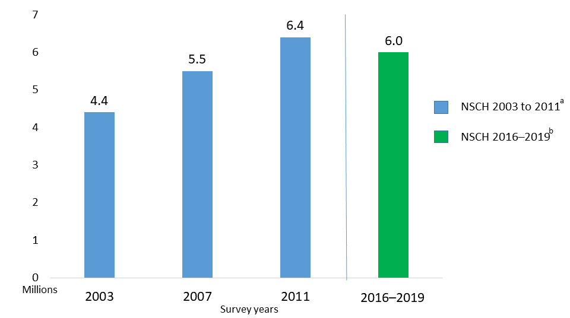

# STORY OF AKASH:

During the COVID lockdown, Akash, a lively 12-year-old boy, found himself confined to his home along with his parents who were now working from home. As they navigated this new normal, they began noticing some unusual behaviors in Akash. He seemed constantly excited, fidgety, and easily distracted. His hyperactivity, impulsivity, and forgetfulness became more apparent each day, leaving his parents concerned.

Recognizing the need for professional advice, Akash's parents took him to the doctor. After careful observation and assessment, the doctor diagnosed Akash with ADHD (Attention Deficit Hyperactivity Disorder). Concerned and confused, Akash's parents listened intently as the doctor explained the condition.

"ADHD is a condition characterized by symptoms like inattention, hyperactivity, and impulsivity," the doctor clarified. "While there's no concrete medical basis for ADHD, it can sometimes be linked to a lack of dopamine in the brain."

The doctor elaborated further, explaining that ADHD could manifest as either predominantly inattentive or hyperactive-impulsive. Treatment options typically involved medications like stimulants or atomoxetine, along with therapy sessions such as occupational therapy or cognitive behavior therapy.

"Children with ADHD may have varying levels of intelligence, but they often struggle with low self-confidence, anxiety, and frustration," the doctor added. "However, with the combined efforts of the child, parents, and teachers, ADHD can be managed effectively."

Armed with this newfound understanding, Akash's parents resolved to support him wholeheartedly in his journey. They sought guidance from the doctor on how to best assist Akash, ensuring he received the necessary therapy and accommodations to thrive despite his diagnosis. With patience, understanding, and a supportive environment, they were determined to help Akash overcome the challenges posed by ADHD and build a brighter future.

# WHAT IS ADHD:

ADHD, or Attention Deficit Hyperactivity Disorder, is a neurodevelopmental disorder characterized by persistent patterns of inattention, hyperactivity, and impulsivity that interfere with daily functioning and development. Individuals with ADHD often struggle with maintaining focus, organizing tasks, and regulating their impulses, which can affect various aspects of their lives, including academics, work, and relationships.

While the exact cause of ADHD is not fully understood, it is believed to involve a combination of genetic, environmental, and neurological factors. ADHD is typically diagnosed during childhood, although symptoms may persist into adulthood. There are three main subtypes of ADHD: predominantly inattentive, predominantly hyperactive-impulsive, and combined presentation. Diagnosis is typically based on a comprehensive evaluation of symptoms, medical history, and observation of behavior. Treatment approaches for ADHD may include medication, behavioral therapy, and educational interventions aimed at helping individuals manage their symptoms and improve their functioning. With proper diagnosis and support, individuals with ADHD can learn to effectively manage their symptoms and lead fulfilling lives.

### SYMPTOMS:

1. **Inattention**: Difficulty sustaining attention on tasks or activities, often making careless mistakes.
2. **Hyperactivity**: Excessive fidgeting, restlessness, or difficulty staying seated in situations where it's expected.
3. **Impulsivity**: Acting without considering consequences, interrupting others, or blurting out answers before questions are complete.
4. **Forgetfulness**: Frequently losing or misplacing items, forgetting appointments, or neglecting tasks.
5. **Poor organization**: Difficulty with organizing tasks, time management, and maintaining neatness.
6. **Distractibility**: Being easily distracted by unrelated stimuli, leading to difficulty focusing on tasks.
7. **Difficulty following instructions**: Trouble following through on instructions or completing tasks, especially those that require sustained mental effort.
8. **Lack of attention to detail**: Overlooking or missing details in work, school assignments, or other activities.
9. **Trouble with transitions**: Difficulty switching focus from one task or activity to another, leading to frustration or resistance.
10. **Impaired executive function**: Challenges with planning, problem-solving, and decision-making.
11. **Restlessness**: Difficulty staying still, often feeling a constant need to move or engage in physical activity.
12. **Talking excessively**: Frequently interrupting conversations or talking excessively, even when it's inappropriate.
13. **Time management difficulties**: Struggling to estimate and manage time effectively, leading to chronic lateness or missed deadlines.
14. **Mood swings**: Fluctuations in mood, including irritability, impatience, and emotional sensitivity.
15. **Difficulty in completing tasks:** Starting multiple tasks but having difficulty completing them, leading to a sense of being overwhelmed or unproductive.

### TREATMENT:

1. **Medication**: Stimulant medications such as methylphenidate (e.g., Ritalin) and amphetamine (e.g., Adderall) are commonly prescribed to manage symptoms of ADHD. Non-stimulant medications like atomoxetine (Strattera) may also be used. These medications help regulate neurotransmitters in the brain to improve attention, focus, and impulse control.
2. **Behavioral Therapy**: Behavioral therapy, including techniques such as cognitive-behavioral therapy (CBT) and behavior modification strategies, can help individuals with ADHD learn coping skills, improve organization, and manage impulsivity. This therapy often involves setting specific goals, implementing structured routines, and providing positive reinforcement for desired behaviors.
3. **Parent Training**: Parents of children with ADHD can benefit from training programs that teach effective parenting techniques tailored to managing ADHD symptoms. These programs focus on providing consistent structure, setting clear expectations, and implementing appropriate consequences to support the child's development.
4. **School Support**: Collaboration between parents, educators, and mental health professionals is crucial in creating supportive environments for students with ADHD. School-based interventions may include individualized education plans (IEPs), accommodations such as extended time on tests or preferential seating, and classroom strategies to address specific challenges related to ADHD.
5. **Multimodal Approach**: A combination of medication, therapy, and environmental adaptations is often the most effective approach to treating ADHD. This multimodal treatment plan is tailored to the individual's needs and may evolve over time based on symptom severity, response to treatment, and developmental changes. Regular monitoring and adjustments to the treatment plan are essential to optimize outcomes and support long-term success.

# LACK OF AWARENESS:

1. **Misconceptions**: Many people have misconceptions about ADHD, such as believing it only affects children or that it's simply a result of bad parenting or lack of discipline.
2. **Stigma**: There is often a stigma associated with ADHD, leading to reluctance among individuals and families to seek help or openly discuss the condition.
3. **Lack of Education**: There is a general lack of education and awareness about ADHD within society, leading to misunderstandings and biases.
4. **Overlooking Symptoms**: ADHD symptoms can sometimes be mistaken for personality traits or simply dismissed as typical behavior, leading to a lack of recognition and intervention.
5. **Cultural Factors**: Different cultures may have varying attitudes and beliefs about mental health and neurodevelopmental disorders, which can influence awareness and acceptance of ADHD.
6. **Media Portrayal**: Media representations of ADHD can be inaccurate or sensationalized, contributing to misunderstandings and reinforcing stereotypes.
7. **Limited Resources**: Access to accurate information and resources about ADHD may be limited in certain communities or regions, further perpetuating ignorance and misunderstanding.
8. **Diagnostic Challenges**: ADHD diagnosis can be complex and often requires specialized assessment by trained professionals, leading to underdiagnosis or misdiagnosis in some cases.
9. **Focus on External Symptoms**: The visible symptoms of hyperactivity and impulsivity may receive more attention than the less obvious symptoms of inattention, leading to an incomplete understanding of the disorder.
10. **Lack of Support Systems**: Without adequate support systems in place, individuals with ADHD and their families may struggle to cope with the challenges posed by the condition, further perpetuating the cycle of unawareness and misunderstanding.

# PROBLEM WITH STUDENTS:

1. **Academic Challenges**: School-going students with ADHD often struggle academically due to difficulties in focusing, staying organized, and completing tasks. According to the Centers for Disease Control and Prevention (CDC), about 50% of children with ADHD experience academic difficulties, such as lower grades and increased risk of academic failure.
2. **Social Difficulties**: Children with ADHD may face challenges in social situations, including making and maintaining friendships, understanding social cues, and controlling impulses. Research suggests that approximately 70% of children with ADHD have difficulties with social interactions, leading to feelings of isolation and loneliness.
3. **Behavioral Issues**: Students with ADHD may exhibit disruptive behavior in the classroom, such as impulsivity, defiance, and difficulty following rules. According to the American Academy of Pediatrics (AAP), up to 50% of children with ADHD display disruptive behavior that interferes with their learning and social interactions.
4. **Parental Concerns**: Parents of children with ADHD often worry about their child's academic performance, social development, and overall well-being. They may struggle with feelings of frustration, guilt, and helplessness, particularly when faced with challenging behaviors and academic setbacks. Studies show that parents of children with ADHD experience higher levels of stress and parenting-related difficulties compared to parents of neurotypical children.
5. **Educational Support:** Parents of children with ADHD may encounter challenges in finding appropriate educational support and accommodations for their child. According to a study published in the Journal of Attention Disorders, only 32% of children with ADHD receive school-based services, such as special education or accommodations under Section 504 plans.
6. **Teaching Strategies:** Educators play a vital role in supporting students with ADHD in the classroom. However, many teachers report feeling ill-equipped to meet the needs of these students effectively. Research indicates that only 17% of teachers receive formal training in ADHD during their pre-service education, highlighting the need for professional development opportunities and resources to enhance teacher knowledge and skills in managing ADHD-related challenges in the classroom.

# OUR SOLUTION: SNIPPETIZE

With the alarming rise in ADHD among school-going students, we introduce 'Snippetize,' a web-based educational platform. Designed to address the needs of students with ADHD, Snippetize offers tailored learning experiences to enhance focus and engagement.

With our innovative approach, Snippetize aims to revolutionize the educational experience for students with ADHD by providing customized learning experiences through small, digestible snippets or chunks of knowledge. These bite-sized lessons are designed to cater to the unique learning needs and attention spans of ADHD students, promoting better retention and comprehension. Additionally, Snippetize incorporates a crucial gamification element, allowing students to earn assets and rewards as they progress through the learning journey. This gamified approach not only makes learning more enjoyable but also motivates students to stay engaged and focused. Moreover, our platform facilitates real-time feedback from students, parents, and teachers, fostering a collaborative learning environment. By promoting positive interaction and focused engagement, Snippetize empowers ADHD students to thrive academically and reach their full potential. Join us in harnessing the power of technology to transform education for all learners.

### FLOW OF PROCESS:

1. *Start* by assessing the needs of ADHD students and establishing project goals and objectives.
2. *Conduct research* to identify effective learning strategies tailored to the specific needs and challenges of ADHD learners.
3. *Define* the website structure, including navigation, content organization, and user flow, to create a seamless user experience.
4. *Gather feedback* from stakeholders, including students, parents, educators, and healthcare professionals, to inform the development process.
5. *Test the functionality* of the web solution, including usability, accessibility, and performance, to ensure a smooth user experience.
6. *Implement features* such as interactive educational content, gamification elements, and real-time feedback mechanisms to enhance engagement and learning outcomes.
7. *Design the user interface (UI)* with a focus on simplicity, clarity, and accessibility to accommodate diverse user needs and preferences.
8. *Iterate and improve* the web solution based on user feedback, data analytics, and ongoing evaluation to optimize effectiveness and usability.
9. *Continuously monitor and evaluate* the impact of the web solution on ADHD learners' academic performance, engagement, and overall well-being.
10. *Conclude* the development process by delivering a comprehensive and effective web solution that empowers ADHD learners to succeed academically and personally.

# SNIPPETIZE:

In the face of rising concerns surrounding Attention Deficit Hyperactivity Disorder (ADHD), exacerbated by the pervasive influence of social media on decreasing attention spans, our team is proud to introduce SNIPPETIZE. This innovative educational platform aims to address the unique challenges faced by children with ADHD by revolutionizing the way they learn.

SNIPPETIZE offers a solution by presenting educational content in bite-sized, easily digestible snippets of knowledge. By breaking down complex concepts into manageable chunks, SNIPPETIZE caters to the shorter attention spans commonly observed in individuals with ADHD. This approach fosters engagement and enhances learning outcomes by making educational material more accessible and engaging for students.

One of the key features of SNIPPETIZE is its integration of gamification elements into the learning process. Through the use of rewards, challenges, and interactive activities, the platform transforms learning into a fun and immersive experience. By gamifying the educational content, SNIPPETIZE not only captures the interest of students but also encourages active participation and sustained engagement.

Furthermore, SNIPPETIZE introduces an innovative incentive system that allows students to earn in-game currency. This currency can then be used to unlock assets from a marketplace, enhancing their gaming avatars and providing a tangible reward for their efforts. In addition to enhancing the gaming experience, this feature also serves to teach valuable lessons in financial literacy and trading acumen, empowering students with essential life skills.

By empowering students with ADHD through SNIPPETIZE, we aim to provide them with the tools and resources they need to succeed academically and personally. Our platform goes beyond traditional educational methods by leveraging technology to create a dynamic and interactive learning environment tailored to the needs of students with ADHD. Through SNIPPETIZE, we hope to make a positive impact on the lives of students worldwide, helping them overcome the challenges associated with ADHD and reach their full potential. Join us in revolutionizing education and shaping the future of learning for generations to come.

### USING SNIPPETIZE:

SNIPPETIZE offers a user-friendly journey tailored to enhance learning experiences for all users:

1. **Engage**: Dive into educational sessions presented through interactive games, providing a dynamic and immersive learning experience. SNIPPETIZE's engaging content captivates users, making learning enjoyable and effective.
2. **Participate:** Join contests and activities available on SNIPPETIZE to earn game currency, fostering motivation and active engagement among users. These incentives encourage ongoing learning and participation in the platform's educational offerings.
3. **Grow**: Explore the platform's marketplace to build and trade assets, promoting financial literacy and self-confidence. By navigating the virtual economy, users develop essential life skills while experiencing the rewards of their learning journey on SNIPPETIZE.

Through these user-friendly features, SNIPPETIZE empowers users to embark on a rewarding educational experience tailored to their needs and preferences. Whether registering for the first time, actively engaging with educational content, providing feedback, participating in contests, or exploring the marketplace, SNIPPETIZE offers a supportive and enriching learning environment for all users.

SNIPPETIZE is more than just a platform for learning—it's a community dedicated to empowering children suffering from snippets. By providing interactive educational experiences, fostering feedback, and encouraging growth, SNIPPETIZE aims to make a positive impact on children's lives. Join us on SNIPPETIZE and embark on a journey of discovery, learning, and growth. Together, we can create a brighter future for children everywhere.

### 3-D GAMIFICATION:

Exploring the Solar System
In the SNIPPETIZE 3D game, children are transported into the vast expanse of space, where they can. Navigate through the solar system, guided by captivating visuals and engaging narration.
Encounter each planet, learning about its characteristics, orbit, and unique features through interactive experiences.
Dive deeper into astrological concepts, such as planetary motion, celestial bodies, and the wonders of the universe.
Earn rewards and badges for completing challenges, mastering content, and showcasing their knowledge.
SNIPPETIZE's innovative approach to education breaks down barriers for children with ADHD, allowing them to pursue their dreams with confidence and enthusiasm. By combining customized learning experiences with interactive 3D games, SNIPPETIZE not only imparts knowledge but also instills a sense of empowerment and achievement. Join us on SNIPPETIZE, where dreams take flight, and every child has the opportunity to shine.

### TECHNOLOGICAL STACK:

1. **FRONTEND**: HTML, CSS, JavaScript
2. **BACKEND**: Firebase
3. **HOSTING**: Cloudflare
4. **VERSION** CONTROL: Git, GitHub
5. **TOOLS AND FRAMEWORKS**: .net framework, utility game engine( C# language), Auth0 (for authentication)

### WEBSITE:

We're thrilled to introduce the Snippetize website, a revolutionary platform designed to transform the educational experience for students worldwide. At Snippetize, we prioritize customized learning, recognizing that every student has unique learning needs and preferences. Our platform offers personalized learning paths tailored to each individual's strengths, challenges, and interests, ensuring that educational content is engaging, relevant, and accessible to all.

In addition to customized learning, Snippetize incorporates gamification elements to enhance user engagement and motivation. Students can earn badges, unlock assets, and climb the leaderboard as they progress through educational activities and challenges. This gamified approach not only makes learning fun and rewarding but also encourages students to stay actively involved in their educational journey.

With Snippetize, we're re-imagining education as a dynamic and interactive experience that empowers students to reach their full potential. Join us on Snippetize and embark on a journey of personalized learning, gamified engagement, and continuous improvement. Together, let's revolutionize education for the betterment of all learners.

For SNIPPETIZE website, [CLICK HERE.](https://swayamkhanduri.github.io/PROPHECY-HackWithIndia/)

# FUTURE PLANS:

1. **Collaboration with Doctors and Teachers**: Work closely with medical professionals and educators to gain insights into the needs and experiences of individuals with ADHD in educational settings.
2. **Analysis of Study Patterns**: Analyze study patterns of ADHD students to better understand their learning behaviors and develop tailored interventions to support their educational journey.
3. **Data Gathering from Gaming**: Gather data from students playing games to observe behavior patterns, aiding future medical studies and informing the design of educational interventions.
4. **Automated Reward Generation:** Implement machine learning and artificial intelligence to automatically generate rewards of game currency, fostering motivation and engagement among ADHD students.
5. **Multilingual Web Platform**: Develop a web-based platform available in 32 different languages to cater to the diverse needs of ADHD students, ensuring accessibility and inclusivity.
6. **Sensory Stimulation Techniques:** Explore sensory stimulation techniques utilizing visual, auditory, and kinesthetic feedback to support hyperactive students, enhancing focus and engagement in learning activities.

Through these strategic initiatives, we aim to create a comprehensive and effective educational solution that empowers individuals with ADHD to thrive academically and personally. Our commitment to data-driven approaches, innovative technologies, and collaborative partnerships underscores our dedication to making a meaningful impact on the lives of ADHD students and their families

# CHALLENGES:

1. **Data Privacy and Security**: Managing sensitive student data gathered from gaming or educational platforms requires robust security measures to ensure compliance with privacy regulations and protect against data breaches.
2. **Technological Integration**: Integrating machine learning, artificial intelligence, and sensory stimulation techniques into educational platforms may pose challenges in terms of compatibility, scalability, and seamless integration with existing systems.
3. **Multilingual Support**: Developing a multilingual web platform that caters to diverse language needs requires careful consideration of translation accuracy, cultural nuances, and technical infrastructure to ensure an inclusive user experience.
4. **User Engagement and Motivation**: Designing educational interventions that effectively engage and motivate ADHD students may require innovative approaches to sustain interest, foster intrinsic motivation, and overcome challenges related to attention and focus.
5. **Collaboration and Stakeholder Engagement**: Building successful partnerships with doctors, teachers, educational institutions, and other stakeholders is essential for gaining insights, validating solutions, and ensuring adoption of educational innovations in real-world settings. Effective communication, collaboration, and alignment of goals are key to navigating these complex relationships.

# CONCLUSION:

In conclusion, our website, Snippetize, stands to address the unique educational challenges faced by individuals with ADHD. From its inception, Snippetize has been driven by a clear vision: to revolutionize education and empower ADHD learners to reach their full potential.

Recognizing the diverse needs of ADHD students, we embarked on a comprehensive journey, starting with a thorough assessment of their requirements and the establishment of clear project goals. Through extensive research, we delved deep into understanding the learning strategies best suited to address the specific needs and challenges of ADHD learners. This research laid the foundation for the development of Snippetize, guiding the creation of a website structure designed to provide a seamless and engaging learning experience.

At the heart of Snippetize lies a commitment to collaboration and continuous improvement. We actively sought feedback from stakeholders, including students, parents, educators, and healthcare professionals, to ensure that Snippetize met their needs and expectations. Through rigorous testing of functionality and usability, we fine-tuned every aspect of the website to ensure optimal performance and user experience.

The implementation of features such as interactive educational content, gamification elements, and real-time feedback mechanisms further enhanced Snippetize's effectiveness in engaging and supporting ADHD learners. By designing a user interface that prioritizes simplicity, clarity, and accessibility, we ensured that Snippetize accommodates the diverse needs and preferences of its users.

Our journey with Snippetize does not end with its launch; rather, it marks the beginning of a new chapter in our commitment to empowering ADHD learners. Through continuous iteration and improvement, we will monitor and evaluate Snippetize's impact on academic performance, engagement, and overall well-being. We remain dedicated to delivering a comprehensive and effective web solution that empowers ADHD learners to succeed academically and personally.

In the ever-evolving landscape of education, Snippetize stands as a beacon of innovation and inclusion, demonstrating the transformative power of technology in creating a more accessible and equitable learning environment for all. With Snippetize, we envision a future where every ADHD learner has the opportunity to thrive and realize their dreams.

---
